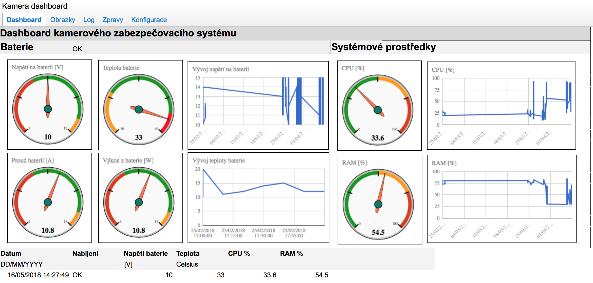

# Camera Security System with Raspberry Pi Minicomputer
This package provides camera security system functionality for the Raspberry Pi minicomputer.
It uses Raspberry Pi NoIR camera for the motion detection and also PIR sensor if available.

Capturing is handled by the picamera package and image processing is handled by the Pillow package.

Captured images are sent to the Google Drive storage.

Package itself consist of four submodules - config, filemanipulation, motion and telemetry.
Each of them has consist of several classes.

## Motion detection
Motion can be detected from the scene using optical flow method and also from the PIR sensor.

Optical flow method is using motion vectors to estimate the motion. Motion vectors are calculated in H.264 encoder provided by the RPi GPU.

This functionality is provided by the picamera, which provides interface to the Raspberry Pi camera so it handles capturing of photos and motion analysis.

Captured photos are compressed using Pillow package and sent to Google Drive.

## Google API Interface

Google API is used for communication with the Google Drive and Google Sheets applications. This functionality is provided by the PyDrive package and google-api-python-client.

Google Sheets are used as a dashboard for the application.

## GSM/GPRS
This package also provides ability to use GSM/GPRS module for the SMS and Internet connectivity.

SMS handling is provided by the pygsmmodule package.
Internet connection is realized via PPP.
GSM/GPRS module requires GSM0710 mux protocol support for multiplexing PPP data flow and SMS which are handled by the AT commands.

